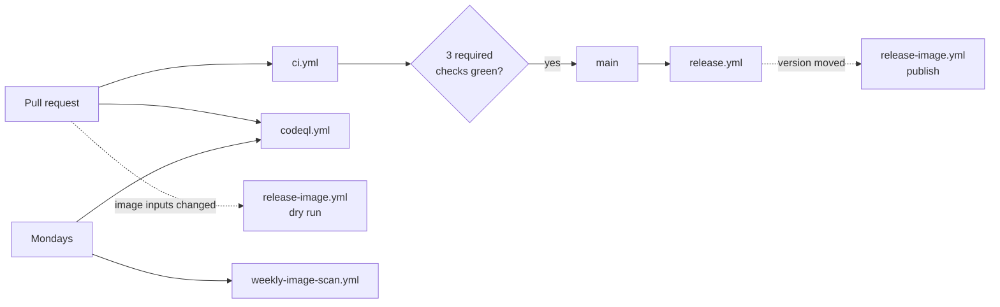

# Workflows

**In short:** what each workflow does, when it runs, and whether it can block a merge.
Release steps are in [docs/releasing.md](../../docs/releasing.md). Rules for changing
workflows are in [AGENTS.md](../AGENTS.md).

## Overview

| Workflow | Runs on | Purpose | Blocks a merge? |
|---|---|---|---|
| [`ci.yml`](ci.yml) | push to `main`, pull requests, manual | Unit tests, lint, types, image build with a CRITICAL scan, compose check, workflow lint, secret scan, Sonar and Codecov | Yes: `Unit tests`, `Build uploader image`, `Validate docker-compose.yml`. `Lint workflows` and `Secret scan` report, but are not required. |
| [`codeql.yml`](codeql.yml) | push, pull requests, Mondays 06:30 UTC | CodeQL analysis of Python and of the workflows | No |
| [`release-image.yml`](release-image.yml) | pull requests that change the Dockerfile, the lock, `pyproject.toml` or the workflow (dry run); dispatch from `release.yml`; manual | Builds both platforms, scans each, writes a CycloneDX SBOM each, pushes to ghcr.io only when publishing | No |
| [`release.yml`](release.yml) | push to `main`, manual (from `main` only) | Tag, GitHub Release, image, milestone | Not applicable |
| [`weekly-image-scan.yml`](weekly-image-scan.yml) | Mondays 06:00 UTC, manual | Full CRITICAL and HIGH scan of the image | No |
| [`docs-impact.yml`](docs-impact.yml) | pull requests (also when the description is edited) | Checks the PR's "Documentation impact" choice against its diff | No |
| [`verify-standard.yml`](verify-standard.yml) | pull requests, push to `main` | Runs the playbook's `verify-tier` against this repository, pinned to a playbook release | No |
| [`scorecard.yml`](scorecard.yml) | push to `main`, Wednesdays 04:00 UTC, branch-protection changes | OpenSSF Scorecard, report-only, publishes the result for the badge | No |

Dependabot is configured in [`../dependabot.yml`](../dependabot.yml): pip, github-actions
and docker, weekly and grouped.

## How they connect

## The jobs in `ci.yml`

| Job (check name) | What it does |
|---|---|
| `test` (`Unit tests`) | ruff, mypy, pytest with coverage, `pip-audit`, and a lock-consistency check |
| `code-quality` (`Code quality (Sonar + Codecov)`) | Uploads coverage and test results to Codecov, runs the SonarCloud scan. Skips cleanly without tokens. Report-only. |
| `build-image` (`Build uploader image`) | Builds the image and runs Trivy, failing on CRITICAL findings that have a fix |
| `compose-lint` (`Validate docker-compose.yml`) | Renders the compose file with placeholder values |
| `lint-workflows` (`Lint workflows (actionlint, zizmor)`) | `actionlint` for correctness (with `shellcheck`), `zizmor` for safety. Both are pinned; `actionlint` is checksum-verified. |
| `secret-scan` (`Secret scan (gitleaks)`) | `gitleaks`, scoped to the commits the run introduces, checksum-verified |
