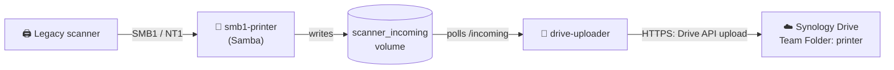

# drive-scanner-bridge

[](https://github.com/solarssk/drive-scanner-bridge/actions/workflows/ci.yml)
[](https://github.com/solarssk/drive-scanner-bridge/releases)
[](docs/deployment.md)
[](LICENSE)

drive-scanner-bridge uploads scans from a legacy SMB1 network scanner to Synology Drive
through Drive's own upload API. It exists because, on the NAS it was built for, Synology
Drive sometimes never picks up files that are written into a shared folder by other means.
The filesystem event arrives but is never consumed, so a scan sits on disk and never shows
up in Drive. The bridge never writes into the Team Folder itself, so that failure cannot
happen.

It does **not**:

- replace Synology Drive, or the Samba container the scanner talks to (0.1.x runs both;
  [the 0.2.0 plan](docs/roadmap/0.2.0-single-container-smb1.md) folds them into one)
- convert, OCR, sort or rename scans (the only change is an optional date prefix on the
  uploaded name)
- handle more than one inbox or more than one Team Folder
- rely on filesystem notifications (it polls, because they are the unreliable part)

<details>
<summary><strong>Table of contents</strong></summary>

- [How it works](#how-it-works)
- [Documentation](#documentation)
- [Quick start](#quick-start)
- [Configuration](#configuration)
- [Security at a glance](#security-at-a-glance)
- [Contributing](#contributing)
- [License](#license)

</details>

## How it works



A file is uploaded only after it has stopped changing. It is identified by its content
hash, so a crash or a restart never loses a scan and never uploads it twice. Failed uploads
are retried with backoff and never given up on.
See [docs/architecture.md](docs/architecture.md) for the details.

## Documentation

| | Doc | Covers |
|---|---|---|
| 🧭 | [docs/README.md](docs/README.md) | Index: "I want to…" with a link for each task |
| 🏗️ | [docs/architecture.md](docs/architecture.md) | Why it exists, how a scan travels, no-duplicate and retry guarantees |
| 🚀 | [docs/deployment.md](docs/deployment.md) | Install with Compose or Portainer, update, roll back, back up |
| ⚙️ | [docs/configuration.md](docs/configuration.md) | Every setting, its default and its meaning |
| 🔒 | [docs/security.md](docs/security.md) | Secrets, container hardening, image build and scanning |
| 🩺 | [docs/troubleshooting.md](docs/troubleshooting.md) | Symptoms, causes and fixes |
| 🔌 | [docs/synology-client.md](docs/synology-client.md) | Why there is a hand-written API client, and what was verified on a real NAS |
| 🧑‍💻 | [docs/development.md](docs/development.md) | Dev setup, checks, code layout |
| 📦 | [docs/releasing.md](docs/releasing.md), [docs/maintenance.md](docs/maintenance.md) | Release process, repository conventions |
| 🤖 | [AGENTS.md](AGENTS.md) | Commands and rules for AI coding agents |
| 📋 | [CONTRIBUTING.md](CONTRIBUTING.md), [SECURITY.md](SECURITY.md), [CHANGELOG.md](CHANGELOG.md) | Contributing, reporting a vulnerability, what changed |

## Quick start

You need Docker on the NAS, the Docker network `smb1_network`, and the Team Folder
`printer` in Synology Drive. The full procedure, including Portainer, is in
[docs/deployment.md](docs/deployment.md).

```bash
git clone https://github.com/solarssk/drive-scanner-bridge.git
cd drive-scanner-bridge
cp .env.example .env          # set SYNOLOGY_HOST, SMB1_STATIC_IP, SMB_PRT01_PASSWORD
printf '%s' 'the DSM password' > secrets/synology_password
docker compose up -d          # pulls ghcr.io/solarssk/drive-scanner-bridge:0.1.4
docker compose logs -f drive-uploader
```

Then confirm that the uploader can reach Synology Drive, without uploading anything:

```bash
docker compose exec drive-uploader python3 -m scanner_drive_bridge.test_connection
```

## Configuration

The settings you are most likely to change are below. All of them, with defaults, are in
[docs/configuration.md](docs/configuration.md).

| Setting | Default | Meaning |
|---|---|---|
| `SYNOLOGY_HOST` | required | URL of the NAS, for example `https://192.0.2.10:5001` |
| `SYNOLOGY_DESTINATION` | `/team-folders/printer` | Drive path that receives the scans |
| `SYNOLOGY_VERIFY_TLS` | `true` | Verify the NAS certificate. Keep it on. |
| `DELETE_AFTER_UPLOAD` | `true` | Remove the local file after a confirmed upload |
| `TIMESTAMP_UPLOAD_FILENAME` | `false` | Prefix uploaded names with today's date |

## Security at a glance

- 🔑 The password comes from a file mounted read-only and is never logged or put in a URL.
- 🔐 TLS verification is on by default and never downgraded silently.
- 🧱 The container runs as a non-root user with a read-only root filesystem, no
  capabilities and no published ports.
- 📦 The image has no shell, is built from digest-pinned bases and is scanned for both
  platforms before it is published.

Details are in [docs/security.md](docs/security.md). To report a vulnerability, follow
[SECURITY.md](SECURITY.md).

## Contributing

Conventions for issues, pull requests and releases are in [CONTRIBUTING.md](CONTRIBUTING.md).
Releases are published automatically when a release pull request is merged; see
[docs/releasing.md](docs/releasing.md).

## License

This project is licensed under the [MIT License](LICENSE).
