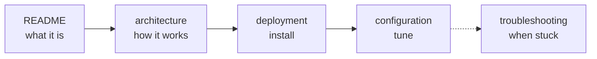

# Documentation

**In short:** the [project README](../README.md) is the front page. The pages here go deep
on one topic each. Start with the row that matches what you want to do.

## I want to…

| I want to… | Read |
|---|---|
| Understand why this exists and how a scan travels | [architecture.md](architecture.md) |
| Install it on my NAS (Compose or Portainer) | [deployment.md](deployment.md) |
| Change a setting | [configuration.md](configuration.md) |
| Fix something that does not work | [troubleshooting.md](troubleshooting.md) |
| Check what protects my credentials | [security.md](security.md) |
| Know why there is no Synology library | [synology-client.md](synology-client.md) |
| Work on the code | [development.md](development.md) |
| Publish a release | [releasing.md](releasing.md) |
| Know the repository conventions | [maintenance.md](maintenance.md) |
| See what is planned | [roadmap/](roadmap/README.md) |

## Reading order for a new operator

## Conventions for these pages

- File names are lowercase kebab-case (`troubleshooting.md`). The exceptions are this
  `README.md` and `AGENTS.md`/`CLAUDE.md`, which are conventional names.
- Every page opens with an **In short** line, so you can decide in ten seconds whether it
  is the right page.
- Long pages have a **Contents** list. Warnings and tips use GitHub callouts
  (`> [!NOTE]`, `> [!WARNING]`). Flows use Mermaid diagrams.
- Writing rules for contributors and agents are in [AGENTS.md](AGENTS.md).
