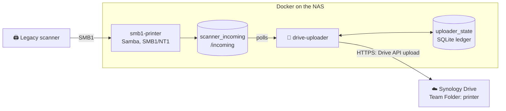
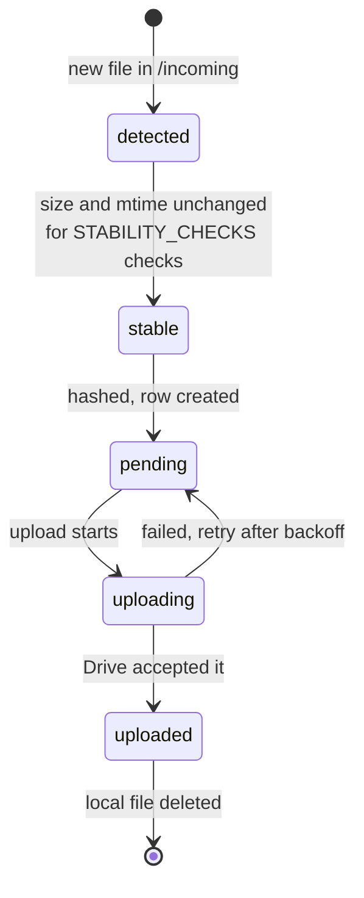
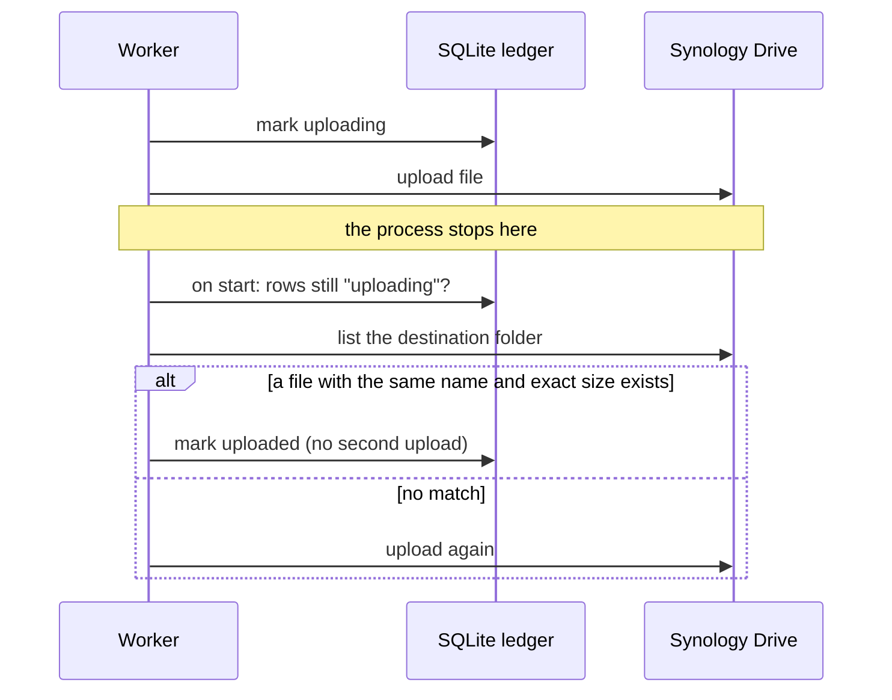
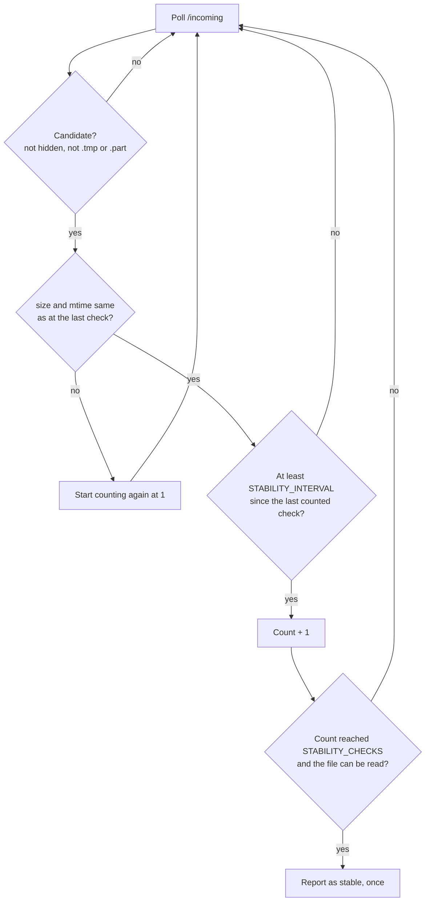

# Architecture

**In short:** the scanner writes to a Samba share, the uploader picks up each finished file
and sends it to Synology Drive through the Drive API, and a small ledger makes sure no scan
is lost or uploaded twice. Settings that tune this are in
[configuration.md](configuration.md).

## Contents

- [Why the bridge exists](#why-the-bridge-exists)
- [How a scan travels](#how-a-scan-travels)
- [How a file is processed](#how-a-file-is-processed)
- [No duplicates and no lost scans](#no-duplicates-and-no-lost-scans)
- [Deciding when a file is complete](#deciding-when-a-file-is-complete)
- [Retries](#retries)
- [The scanner side](#the-scanner-side)

## Why the bridge exists

On the NAS this project was built for, Synology Drive has a confirmed bug. Files that are
written to a shared folder from outside Drive are sometimes never picked up.

| Step | What happens |
|---|---|
| 1 | `synotifyd` receives the filesystem change event and creates the queue file `@drive.synotifyd.queue.toread.*` |
| 2 | The queue generation counter goes up |
| 3 | The event is **not** consumed: `minimum gen in EventManager` stays at `0` |
| 4 | The file exists on disk and in File Station, but never appears in Synology Drive |

The only reliable workaround found was a manual rescan:

```bash
/var/packages/SynologyDrive/target/bin/cloud-control synotifyd-rescan --view_id 21 --path /
```

> [!NOTE]
> That command is a workaround, and this project does not rely on it. The bridge avoids
> the filesystem-event pipeline completely.

The idea:

1. Scans never get written to the Team Folder directly. They land in a private inbox.
2. `drive-uploader` uploads each file through the Synology Drive API
   (`SYNO.SynologyDrive.Files`), the same path the Synology Drive client uses.
3. When the API accepts the upload, Drive already knows about the file. No separate
   notification step is left that could fail.

## How a scan travels



| Component | Role |
|---|---|
| `smb1-printer` | A Samba container (`dperson/samba`) forced to the SMB1/NT1 dialect, because the scanner speaks nothing newer. It no longer mounts `/volume1/printer`. |
| `scanner_incoming` | A Docker volume shared by both containers. Working storage only: files stay until the upload is confirmed. |
| `drive-uploader` | This project's Python service. It watches `/incoming` and uploads to Synology Drive. |
| `uploader_state` | A Docker volume with the SQLite ledger and the heartbeat file. |
| Team Folder `printer` | A normal DSM shared folder. Only `drive-uploader` writes to it, through the Drive API. |

**Network and privileges.** `drive-uploader` is not on `smb1_network`. It only needs
outbound HTTPS to the DSM port of the NAS, so it stays off that network (least privilege)
and reaches the NAS through the default Docker bridge. If your routing does not allow
that, see [Troubleshooting](troubleshooting.md#drive-uploader-cannot-reach-the-nas).

## How a file is processed

Each file moves through these stages. Only the last three are stored in the ledger. The
first two live in memory.



| Stage | Meaning |
|---|---|
| `detected` | The file was seen. It may still be written. |
| `stable` | It stayed unchanged long enough, and it can be opened for reading. |
| `pending` | Its SHA-256 hash is recorded. It waits for upload or for a retry. |
| `uploading` | An upload is in flight. |
| `uploaded` | Drive accepted the file. The local copy is deleted afterwards (default). |

## No duplicates and no lost scans

This is the part that does the most damage when done carelessly, so the rules are exact.
They are also documented in the `worker.py` and `state.py` docstrings.

| # | Rule | Why |
|---|---|---|
| 1 | Files are identified by **content hash**, not by name. | The scanner reuses names such as `SCN_0001.pdf`, so a name cannot answer "did I already handle this". |
| 2 | A file is deleted **only after** `uploaded` is committed. | A crash in between leaves a harmless local copy, never a lost scan. |
| 3 | A failed HTTP response does **not** prove the upload failed. | The server may have stored the file before the connection broke. |
| 4 | `conflict_action=autorename` is a safety net, not the dedup mechanism. | It only covers the scanner reusing a name for different content. |
| 5 | Identical content means the same document. | The second copy is removed locally and not uploaded again. |

Rules 2 and 5 are always logged, for example
`duplicate content detected ... removing local duplicate without re-upload`. They are
never silent.

### What happens after a crash

If the process stops while a row is `uploading`, startup reconciliation
(`Worker._reconcile_in_flight`) checks the real destination before any retry:



## Deciding when a file is complete

The scanner may write a file in pieces, and uploading too early would send a partial scan.
Detection is polling, not inotify: the whole premise of this project is that the NAS
filesystem notifications are unreliable.



- **Real time, not poll count.** The settle time is enforced separately from the polling
  rate, so a fast `SCAN_INTERVAL_SECONDS` does not shorten it. Taking (and deleting) a
  file the scanner still has open can make the scanner's own SMB session fail.
- **Ignored files:** hidden files (`.foo`), editor lock files (`~foo`), and partial-write
  suffixes (`.tmp`, `.part`, `.partial`, `.crdownload`).
- **Reported once.** A stable file is not reported again while it stays unchanged. Without
  this, a file waiting through retry backoff would be re-hashed and re-logged on every
  poll. The logic is `StabilityTracker` in
  [`scanner.py`](../uploader/scanner_drive_bridge/scanner.py).

## Retries

A failed upload backs off along `RETRY_BACKOFF_SECONDS`. With the default
`5,15,30,60,300`, the waits and log messages look like this:

| Failure number | 1 | 2 | 3 | 4 | 5 | 6 | 7 and later |
|---|---|---|---|---|---|---|---|
| Wait before the retry | 5 s | 15 s | 30 s | 60 s | 300 s | 300 s | 300 s |
| Log level | `WARNING` | `WARNING` | `WARNING` | `WARNING` | `WARNING` | `ERROR` | `ERROR` |
| Message | `upload failed attempt=N` | same | same | same | same | `permanent upload failure` | `upload still failing` |

> [!IMPORTANT]
> A file is never given up on and never deleted after a failure. It is deleted only after
> a confirmed upload.

"Permanent" means "an operator should look at this", not "the service stopped trying".
The last interval repeats for as long as the problem lasts.

## The scanner side

The scanner configuration does not change. It connects to the same fixed `SMB1_STATIC_IP`
over SMB1/NT1, with the same Samba compatibility settings as before:

- protocol fixed to NT1 for server and client
- `ntlm auth` and `lanman auth` enabled
- signing and encryption disabled
- recycle bin disabled (`-r`)

The one change is where the share is stored: `/share` is backed by the `scanner_incoming`
volume instead of a bind mount to `/volume1/printer`.
