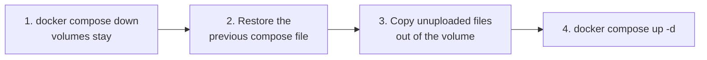

# Deployment

**In short:** run the stack with Docker Compose over SSH or with Portainer, check the
connection before you trust it with real scans, and update by changing one image tag. This
page also covers rollback and backup.

## Contents

- [Before you start](#before-you-start)
- [Choose an install path](#choose-an-install-path)
- [Install with Docker Compose](#install-with-docker-compose)
- [Install with Portainer](#install-with-portainer)
- [Check that it works](#check-that-it-works)
- [Update to a new release](#update-to-a-new-release)
- [Roll back](#roll-back)
- [Backup](#backup)

## Before you start

| You need | Notes |
|---|---|
| Docker (Container Manager) on the NAS | |
| The Docker network `smb1_network` | It already exists in the setup this project extends. |
| The Team Folder `printer` in Synology Drive | The bridge does not create it. |
| A DSM account for the uploads | The examples use `prt01`. It needs write access to that Team Folder. |

The image is published to `ghcr.io/solarssk/drive-scanner-bridge` for `linux/amd64` and
`linux/arm64`. Each release has one exact version tag, and there is no `latest`.

> [!TIP]
> If the package is private, log in once with `docker login ghcr.io` and a GitHub personal
> access token with the `read:packages` scope.

## Choose an install path

| | Docker Compose | Portainer |
|---|---|---|
| Where you work | SSH on the NAS | The Portainer web UI |
| How the image arrives | `docker compose up` pulls it | The stack pulls it |
| How you update | `git pull`, then `docker compose pull` | Edit the image tag in the stack, update the stack |
| Extra setting | none | `PROJECT_DIR`, so the `secrets` mount resolves |

Both use the same `docker-compose.yml`, unchanged.

## Install with Docker Compose

1. Get the repository and create your settings file:

   ```bash
   git clone https://github.com/solarssk/drive-scanner-bridge.git
   cd drive-scanner-bridge
   cp .env.example .env
   ```

2. Edit `.env`. At minimum set `SYNOLOGY_HOST`, `SMB1_STATIC_IP` and `SMB_PRT01_PASSWORD`.
   Every setting is listed in [configuration.md](configuration.md).

3. Store the DSM password in a file. It is mounted into the container read-only:

   ```bash
   printf '%s' 'the DSM password of the upload account' > secrets/synology_password
   ```

   If the NAS uses a self-signed certificate, also put the CA certificate in
   `secrets/synology_ca`. Without that file the container uses its default trust store.

4. Start the stack and watch the uploader log:

   ```bash
   docker compose up -d
   docker compose logs -f drive-uploader
   ```

   You should see `authenticated to Synology Drive` and
   `destination team folder 'printer' verified`.

<details>
<summary>Build the image yourself instead of pulling it</summary>

For development, or when there is no registry access, build under the name the compose
file expects before `up`:

```bash
docker build -t ghcr.io/solarssk/drive-scanner-bridge:0.1.5 ./uploader
```

</details>

## Install with Portainer

<details>
<summary>Why this path differs from plain Compose</summary>

The Portainer container usually cannot read host paths such as `/volume1/...`. A `build:`
section that points at a host path then fails with `Cannot locate specified Dockerfile`,
even though the path is valid on the NAS. Bind mounts are not affected, because `dockerd`
runs natively on DSM and sees the whole disk.

Portainer also tries to build any stack service that has a `build:` section, even when a
matching image already exists. For that reason `docker-compose.yml` has no `build:` for
`drive-uploader`. The image always comes from the registry, or must already exist locally
under the same name.

</details>

1. **Image.** Nothing to build: the stack pulls
   `ghcr.io/solarssk/drive-scanner-bridge:0.1.5`. If the package is private, add the
   registry once under Registries, Add registry, Custom, with URL `ghcr.io`, your GitHub
   user name and a token with `read:packages`.

   <details>
   <summary>No registry access</summary>

   Images, Build a new image, method **Upload**. Upload a tarball of the contents of
   `uploader/`, with the Dockerfile at the root of the archive. Name the image exactly like
   the `image:` line in `docker-compose.yml`.

   </details>

2. **Secret.** Create a folder on the NAS and put the password file in it, for example
   with File Station:

   ```text
   /volume1/docker/scanner-drive-bridge/secrets/synology_password
   ```

   The file contains the plain-text DSM password. You can add `secrets/synology_ca` next
   to it.

3. **Stack.** Stacks, Add stack:
   - Name: `scanner-drive-bridge` (or any name).
   - Build method: **Web editor**. Paste the contents of `docker-compose.yml` unchanged.
   - Environment variables, at least:

     | Variable | Value |
     |---|---|
     | `PROJECT_DIR` | `/volume1/docker/scanner-drive-bridge` |
     | `SMB_PRT01_PASSWORD` | the Samba password of `prt01` |
     | `SMB1_STATIC_IP` | a free fixed IP on your `smb1_network` subnet |
     | `SYNOLOGY_HOST` | the URL of your NAS, for example `https://192.0.2.10:5001` |

     Add any other setting from [configuration.md](configuration.md) that you need.
   - Click **Deploy the stack**.

4. **Watch the start.** Containers, `drive-uploader`, Logs. Look for
   `authenticated to Synology Drive` and `destination team folder 'printer' verified`. If
   the NAS is briefly unreachable, the uploader keeps retrying; see
   [Troubleshooting](troubleshooting.md).

## Check that it works

Run the connectivity check before you trust the stack with real scans:

```bash
docker compose exec drive-uploader python3 -m scanner_drive_bridge.test_connection
```

It logs in, lists the Team Folders and confirms that `printer` can be listed. It does not
upload anything.

To also test an upload, opt in explicitly. This uploads one small, uniquely named file and
deletes it again:

```bash
docker compose exec -e SCANNER_BRIDGE_TEST_UPLOAD=true drive-uploader \
  python3 -m scanner_drive_bridge.test_connection
```

> [!NOTE]
> The image has no shell, so Portainer's console cannot open `/bin/sh`. Run the check
> from SSH, or see
> [Troubleshooting](troubleshooting.md#there-is-no-shell-in-the-container) for the console.

## Update to a new release

1. Read the notes on the
   [Releases page](https://github.com/solarssk/drive-scanner-bridge/releases).
2. Change to the new exact version tag. Never use a moving tag, so it is always clear
   which image the container runs.

   | Path | How |
   |---|---|
   | Compose | `git pull`, then `docker compose pull drive-uploader`, then `docker compose up -d` |
   | Portainer | Change the version in the `image:` line of the stack YAML, then Update the stack with **Re-pull image** ticked |

3. Watch `docker compose logs -f drive-uploader`. The start-up sequence shows
   authentication, the destination check and recovery of interrupted uploads.

The volumes `uploader_state` and `scanner_incoming` survive the update. Pending files and
their retry history are kept.

## Roll back

This returns you to a plain Samba setup that writes straight into `/volume1/printer`,
without the bridge.

> [!IMPORTANT]
> You need your previous compose file. It is not stored in this repository.



1. Stop both containers. The volumes stay in place: `docker compose down`.
2. Restore the previous compose file, the one that binds `/volume1/printer:/share` and has
   no `drive-uploader` service.
3. Before starting it, copy out anything in the `scanner_incoming` volume that has not
   been uploaded yet:

   ```bash
   docker run --rm -v scanner-drive-bridge_scanner_incoming:/src -v /volume1/printer:/dst \
     alpine cp -a /src/. /dst/
   ```

4. Start the restored stack with `docker compose up -d`.

Rollback never races a deletion. Nothing in `/incoming` is removed before a confirmed
upload, so step 3 copies exactly the files that never reached Synology Drive.

## Backup

| What | Advice |
|---|---|
| `scanner_incoming` | Working storage only. Files stay until the upload is confirmed. **Do not back it up.** |
| `uploader_state` | Worth keeping for a clean upload history, but not precious. If it is lost, files still in `/incoming` are hashed and uploaded again, and `autorename` prevents overwrites. |
| Team Folder `printer` | A normal DSM shared folder. Cover it with your existing Hyper Backup or Snapshot Replication policy, as before. |
| `/volume2/docker/smb1-printer/{state,log,cache}` | Samba data, unchanged from the earlier setup. Keep the backup treatment it had. |
