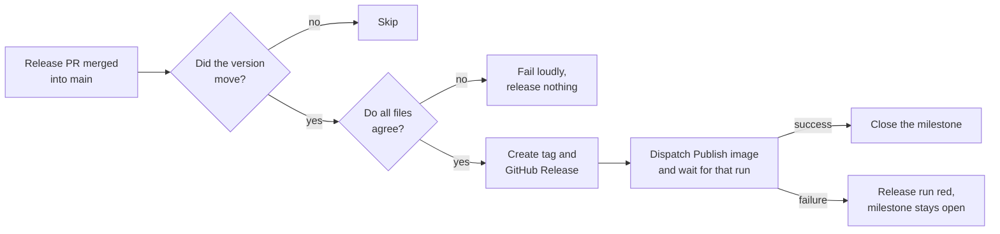
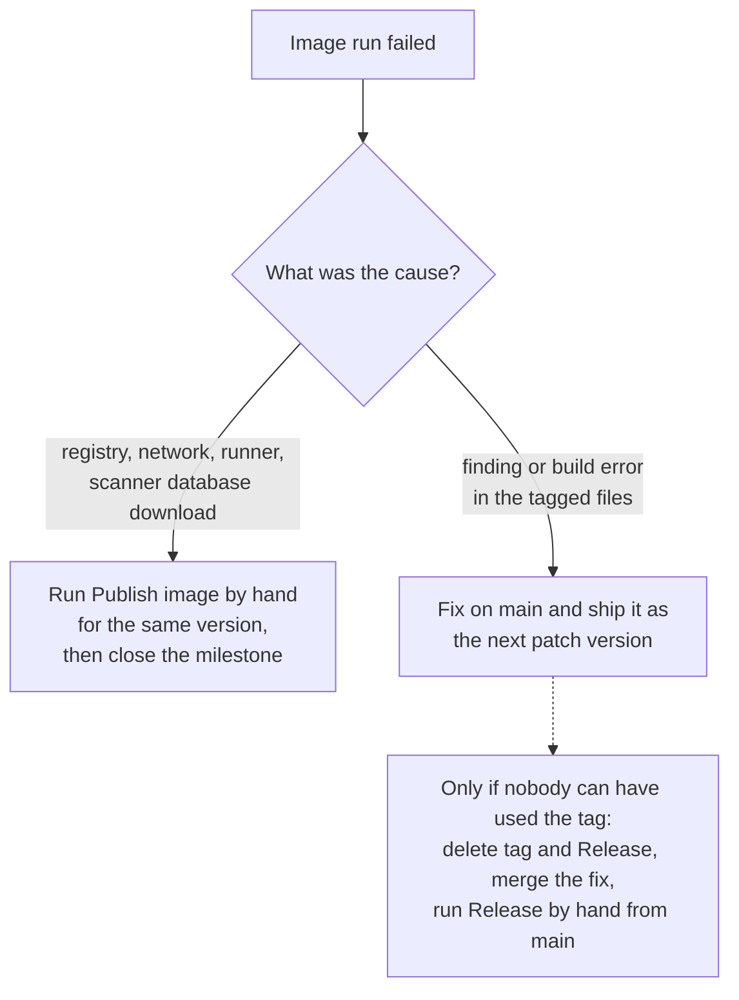

# Releasing

**In short:** merging a release pull request *is* the release. The automation creates the
git tag, the GitHub Release and the container image, and closes the milestone. You only
prepare the pull request.

## Contents

- [What a release produces](#what-a-release-produces)
- [How the automation works](#how-the-automation-works)
- [Prepare a release](#prepare-a-release)
- [When something fails](#when-something-fails)
- [Manual use](#manual-use)
- [Container registry (ghcr.io)](#container-registry-ghcrio)

## What a release produces

| Artifact | Where |
|---|---|
| Git tag `X.Y.Z` (no `v` prefix) | On the merge commit |
| GitHub Release | Notes built from the CHANGELOG by `scripts/format_release_notes.py` |
| Container image | `ghcr.io/solarssk/drive-scanner-bridge:X.Y.Z` for `linux/amd64` and `linux/arm64` |
| Closed milestone | The one named exactly like the version |

## How the automation works

`.github/workflows/release.yml` runs on every push to `main`.

The files that must agree are `uploader/pyproject.toml`, `__version__`, the `image:` tag in
`docker-compose.yml` and the CHANGELOG heading.

`Publish image` (`release-image.yml`) then builds each platform, scans each one, and only
then pushes. CRITICAL or HIGH findings with a fix stop the publish.

> [!NOTE]
> The release workflow waits for the exact run it started. It uses the run URL that `gh`
> returns, or else a request id in the run's title. A manual `Publish image` run for the
> same version can never be mistaken for it.

## Prepare a release

1. Close or move every issue in the milestone. The milestone is named like the version,
   for example `0.1.5`.
2. Bump the version everywhere it is written:
   - `uploader/pyproject.toml`
   - `uploader/scanner_drive_bridge/__init__.py`
   - the `image:` tag in `docker-compose.yml`
   - every image tag in the docs: `grep -rn "<old version>" README.md docs`
3. In `CHANGELOG.md`, turn `[Unreleased]` into `## [X.Y.Z] - YYYY-MM-DD`. The heading
   format is exact, because the release notes are built from it. Add a fresh empty
   `[Unreleased]` above it.
4. Open a `release/X.Y.Z` pull request and wait for CI.
5. Look at the `Build, scan, publish` dry run. It runs because a release PR changes
   `uploader/pyproject.toml`. It is not a required check, so check it yourself. It scans
   both platforms exactly as the release will, so a fixable finding shows up before the
   tag exists.
6. The owner merges. Afterwards check that the `Release` run is green and that the tag
   appears under `github.com/solarssk?tab=packages`.

## When something fails

If the image run fails, the `Release` run goes red and the milestone stays open. The tag
and the GitHub Release already exist, but the image does not. Nothing vulnerable is ever
pushed.

Open the failed `Publish image` run and decide by the cause:

A finding in the tagged files, such as a fixable CVE in a pinned base image or a locked
package, fails the same way every time. The fix is a new commit and a tag never moves.
Edit the broken Release to say it has no image and point to the new version.

## Manual use

| Situation | What to do |
|---|---|
| Finish or repeat a release | Actions, Release, Run workflow, **from `main`**. It repeats the steps for the version in `pyproject.toml`. Each step is safe to repeat. |
| A fix was merged after a *failed* `Release` run | Run `Release` by hand from `main`. The fix push does not move the version, so it releases nothing by itself. The run says so in a warning. |
| A tag exists but has no image | Run `Publish image` with the version and `publish` ticked. It builds that tag's files, whichever branch you start it from. |
| Someone pushes a tag by hand | Don't. The automation owns tags. A hand-pushed tag still publishes an image, but gets no Release and no milestone closing. |

> [!WARNING]
> `Release` refuses any branch except `main`, and a tag that sits on a different commit
> fails the run on purpose. This prevents a release from being attached to the wrong code.

`Publish image` records the commit it built in the image's `revision` label, and it never
overwrites a version that is already on ghcr.io.

## Container registry (ghcr.io)

- The first push creates the package **private**. Make it public once: package settings
  on GitHub, Danger Zone, Change visibility (there is no API for it). Or give Portainer a
  registry credential with a token that has `read:packages`.
- The workflow sets the `org.opencontainers.image.source` label, which links the package
  to this repository.
- Only exact version tags are published, with no `latest`, so a deployment never moves by
  itself. A published tag is immutable.
- A pull request that touches the workflow, the Dockerfile, `requirements.txt` or
  `uploader/pyproject.toml` runs the same pipeline as a dry run. Both platforms are built
  and scanned, and nothing is pushed.
