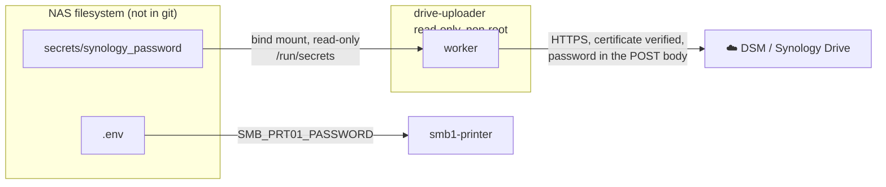

# Security

**In short:** the password lives in a read-only file, never in the image, a log or a URL.
The container runs with the least privilege that works, and the image is built from pinned,
scanned bases. To report a vulnerability, use [SECURITY.md](../SECURITY.md).

## Contents

- [Secrets and credentials](#secrets-and-credentials)
- [Two-factor authentication](#two-factor-authentication)
- [TLS to the NAS](#tls-to-the-nas)
- [Container hardening](#container-hardening)
- [Image build](#image-build)
- [Vulnerability scanning](#vulnerability-scanning)
- [Supply chain](#supply-chain)

## Secrets and credentials

Nothing secret is stored in the source or in the image. This is where each secret lives and
where it goes:



| Secret | How it is supplied |
|---|---|
| Synology Drive password (account `prt01`) | File `secrets/synology_password`, mounted read-only at `/run/secrets/synology_password` and read through `SYNOLOGY_PASSWORD_FILE`. |
| Custom or self-signed CA (optional) | File `secrets/synology_ca`, mounted at `/run/secrets/synology_ca` and read through `SYNOLOGY_CA_FILE`. |
| Samba password of `prt01` | `SMB_PRT01_PASSWORD` in `.env`. The `dperson/samba` image accepts it only as a command-line argument and has no secrets-file support, so `.env` substitution is the closest option. |

`secrets/` and `.env` are ignored by git. Only `secrets/.gitkeep` is tracked.

> [!IMPORTANT]
> The password and the session id never appear in logs. The login request sends the
> credentials in the POST body, not in the query string, because a query string ends up in
> connection-error messages and in the DSM access log.

A live smoke test caught this early. Tests in `tests/test_synology_client.py` and
`tests/test_config.py` guard against a regression.

## Two-factor authentication

`prt01` is a machine account used only by this service. If DSM enforces two-factor
authentication for all users, exclude that account instead of trying to feed it a rotating
code: Control Panel, User, the account, "Allowed to skip 2-factor authentication".

The service accepts a fixed `SYNOLOGY_OTP_CODE`, but a one-time code expires, so it cannot
work for ongoing use. The shipped compose file does not pass it on from `.env`. You can
give it to a one-off command, for example
`docker compose exec -e SYNOLOGY_OTP_CODE=123456 drive-uploader python3 -m scanner_drive_bridge.test_connection`.

## TLS to the NAS

Certificate verification is on by default (`SYNOLOGY_VERIFY_TLS=true`) and is never
downgraded silently. If the NAS uses a self-signed or internal CA, put the CA certificate
in `secrets/synology_ca` instead of turning verification off. If you do disable it, the
service logs a warning at startup.

This is the main reason the project has its own API client; see
[synology-client.md](synology-client.md).

## Container hardening

Set in `docker-compose.yml` for `drive-uploader`:

- Runs as a fixed non-root user, `1048:100`, matching the `prt01` account.
- Read-only root filesystem. Only `/incoming`, `/data` and a `/tmp` tmpfs are writable.
- `cap_drop: [ALL]` and `no-new-privileges`.
- No published ports and no Docker socket.
- Not on `smb1_network`. It needs only outbound HTTPS to the DSM port of the NAS.

## Image build

The `Dockerfile` is a multi-stage build:

- Dependencies are installed in a `python:3.13-slim` builder stage.
- The final image is [Google's distroless `python3-debian13`](https://github.com/GoogleContainerTools/distroless).
  It has no shell, package manager, coreutils or `perl`, so there are no unused operating
  system packages to patch.
- The builder uses the same Python version (3.13) as the final image, so the compiled
  extension of `charset_normalizer` (a dependency of `requests`) stays compatible instead
  of silently falling back to the pure-Python path.
- Both base images are pinned by digest. A base-image change is therefore always a
  reviewable pull request and never a silent `:latest` drift.
- Python dependencies are installed from a hash-locked `requirements.txt`.

## Vulnerability scanning

Scan the published image yourself after any base-image change. This is the scanner and the
flags CI uses, and it needs no account:

```bash
trivy image --severity CRITICAL,HIGH --ignore-unfixed ghcr.io/solarssk/drive-scanner-bridge:0.1.7
```

A clean scan is a snapshot, not a guarantee. New CVEs are published against released
packages, and the distroless image carries the system libraries Python links against
(glibc, libssl, libsqlite3, zlib and others). A scan also lists Debian findings that have
no fix yet. The gates below ignore those (`ignore-unfixed`), because nothing in this
repository can fix them.

| Where | What it checks | Effect |
|---|---|---|
| `ci.yml`, job `build-image` | CRITICAL findings that have a fix | Fails the pull request. |
| `weekly-image-scan.yml` | CRITICAL and HIGH findings that have a fix, weekly | Does not block merges. |
| `release-image.yml` | CRITICAL and HIGH findings that have a fix, for `amd64` and `arm64` separately | Stops the publish. The image is scanned **before** it is pushed. |

Pull requests are gated only on CRITICAL because HIGH findings in operating system
packages often trail Google's own distroless rebuilds by days. Gating every pull request
on them would block unrelated work for something no code change here can fix.

The base moved from `python3-debian12` to `python3-debian13` in 0.1.1. The debian12 image
had not picked up Debian's fixes for weeks (25 fixable HIGH findings, red in the weekly
scan from 2026-09-14). The debian13 image had no fixable CRITICAL or HIGH findings.

## Supply chain

What protects the project from a bad dependency, a compromised action or a tampered image:

| Control | What it does |
|---|---|
| Hash-locked Python dependencies | The image installs `requirements.txt` with `--require-hashes`, and CI checks that the lock covers everything `pyproject.toml` declares. The dev tools CI runs are locked the same way (`requirements-dev.txt`). |
| Pinned base images | Both bases are pinned by digest. |
| Actions pinned to a commit | Every action is pinned to a full commit SHA, with the version in a comment. |
| Dependabot with a cooldown | Weekly, grouped, and a version is proposed only 7 days after it is published. A compromised release is usually pulled within days. Security updates ignore the cooldown. |
| `pip-audit` | Audits the dependencies in every CI run. |
| Workflow lint | `actionlint` checks correctness, `zizmor` checks safety (template injection, permissions, unpinned actions). |
| Secret scan | `gitleaks` scans the commits of each run, next to GitHub's own secret scanning and push protection. |
| SBOM per release | A CycloneDX file per platform is attached to the GitHub Release. |
| OpenSSF Scorecard | An independent, public score of these practices. Report-only, never a merge gate. |

### Reading the SBOM

Each release has `sbom-linux-amd64.cdx.json` and `sbom-linux-arm64.cdx.json` as assets. They
list every package inside the image that was scanned and pushed. To check a past release
against a new CVE without pulling the image:

```bash
trivy sbom --severity CRITICAL,HIGH sbom-linux-amd64.cdx.json
```

> [!NOTE]
> The SBOMs are attached right after the image is published. If that step could not run
> (for example when a release is repeated after the image already exists), the release run
> shows a warning and the image is still fine.
