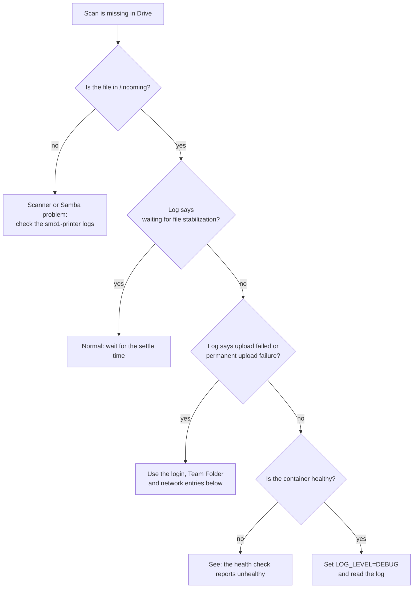

# Troubleshooting

**In short:** find your symptom, read the cause, apply the fix. Start with the log:
`docker compose logs drive-uploader`. For more detail set `LOG_LEVEL=DEBUG`.

## A scan did not arrive in Synology Drive



## Symptoms

| Symptom | Go to |
|---|---|
| `exec: "sh": executable file not found` | [No shell](#there-is-no-shell-in-the-container) |
| The uploader cannot reach the NAS | [Network](#drive-uploader-cannot-reach-the-nas) |
| `error_code 103` at login | [Error 103](#login-works-in-the-browser-but-the-service-reports-error_code-103) |
| Login fails over HTTP or through a proxy | [Proxy login](#login-fails-over-plain-http-or-through-a-proxy) |
| `destination team folder was not found` | [Team Folder](#uploads-fail-with-destination-team-folder-was-not-found) |
| Uploads succeed but verification fails | [Verification](#uploads-succeed-but-folder-verification-does-not-recognize-the-result) |
| Container is `unhealthy` | [Health check](#the-health-check-reports-unhealthy) |

## There is no shell in the container

**Symptom.** Opening a console fails with
`OCI runtime exec failed: exec: "sh": executable file not found`.

**Cause.** The image is distroless. It has no shell on purpose; see
[security.md](security.md#image-build).

**Fix.** Run a specific command directly. `docker exec` runs exactly that command and needs
no shell:

```bash
docker exec drive-uploader python3 -m scanner_drive_bridge.main healthcheck
docker exec drive-uploader python3 -c "print(open('/data/heartbeat.json').read())"
```

In Portainer's console dialog, replace the pre-filled command (`/bin/sh`) with `python3` to
get an interactive interpreter. From there:

```python
print(open('/data/heartbeat.json').read())
from scanner_drive_bridge.main import run_healthcheck; run_healthcheck()
```

> [!WARNING]
> Do not call the module as `-m ... healthcheck` inside that interpreter. It raises
> `SystemExit` into the session.

## drive-uploader cannot reach the NAS

**Symptom.** Connection errors to the DSM address at startup.

**Cause.** The uploader is intentionally not on `smb1_network`. It reaches the DSM port
over the default Docker bridge network, and some network setups do not allow that.

**Fix.** Add the uploader to `smb1_network` as well: add a `networks:` entry with
`smb1_network` to the `drive-uploader` service in `docker-compose.yml`. Do not switch to
host networking.

## Login works in the browser but the service reports error_code 103

**Cause.** A mismatch between the API versions the service uses and what the NAS offers.

**Fix.** Find the startup log line `discovered Synology API versions: ...`. It shows what the
NAS advertises for `SYNO.API.Auth`, `SYNO.SynologyDrive.Files` and
`SYNO.SynologyDrive.TeamFolders`. Compare it with the DSM API documentation for your
version. What has been verified is in
[synology-client.md](synology-client.md#compatibility).

## Login fails over plain HTTP or through a proxy

**Cause.** The login sends the credentials in the POST body, not in the query string. A
proxy that strips POST bodies, or a DSM or Drive Server build that rejects a POST login,
makes the login fail.

**Fix.** Use HTTPS to the NAS directly.

> [!CAUTION]
> As a last resort, `SynologyDriveClient.login()` can be changed back to send `params=`.
> That puts the password into the query string, and from there into connection-error
> messages and the DSM access log. Do it only if there is no other way.

## Uploads fail with "destination team folder was not found"

**Cause.** The Team Folder does not exist. The bridge does not create it.

**Fix.** Create it in Synology Drive: Admin Console, Team Folders. The name must match the
last part of `SYNOLOGY_DESTINATION` (default `/team-folders/printer`).

## Uploads succeed but folder verification does not recognize the result

**Cause.** The NAS response has a shape the parser does not know. Parsing is defensive
(`_extract_items` in `synology.py` accepts several shapes). When none match, it logs the
keys of the raw response at `DEBUG` level. It never logs file contents or secrets.

**Fix.** Set `LOG_LEVEL=DEBUG`, reproduce the problem and read the logged keys.

## The health check reports unhealthy

The check fails in exactly two cases:

| Trigger | Setting | Default | What it points to |
|---|---|---|---|
| The worker heartbeat is too old | `HEALTHCHECK_MAX_LOOP_AGE_SECONDS` | 120 s | A stuck process. A briefly unreachable NAS does not trigger it. |
| The oldest pending file is too old | `HEALTHCHECK_MAX_BACKLOG_AGE_SECONDS` | 6 h | A real, long-lived backlog |

**Fix.** Read `docker compose logs drive-uploader` and the `last_error` field of the
heartbeat:

```bash
docker compose exec drive-uploader python3 -c "print(open('/data/heartbeat.json').read())"
```

The image has no `cat`, which is why the command uses Python.
