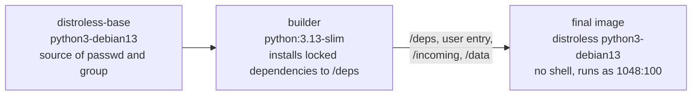

# uploader

**In short:** the Python service that does the work. It watches `/incoming`, decides when a
file is complete, and uploads it to Synology Drive. The project overview is in the
[main README](../README.md).

## Layout

```text
uploader/
├── scanner_drive_bridge/   the service
│   ├── main.py             entry point and health check
│   ├── worker.py           main loop, upload, retry, crash recovery
│   ├── scanner.py          StabilityTracker: is the file complete?
│   ├── state.py            SQLite ledger keyed by content hash
│   ├── synology.py         Synology Drive API client
│   ├── config.py           settings from environment variables
│   └── test_connection.py  connectivity check for operators
├── tests/                  unit tests (the Synology API is mocked)
├── Dockerfile              multi-stage build, distroless runtime
├── pyproject.toml          package metadata and dev tools
├── requirements.in         runtime dependencies (input)
├── requirements.txt        hash-locked runtime dependencies (generated)
├── requirements-dev.in     dev tools (input)
└── requirements-dev.txt    hash-locked dev tools (generated)
```

## Run the checks

```bash
python3 -m venv .venv && .venv/bin/pip install --require-hashes -r requirements-dev.txt && .venv/bin/pip install --no-deps -e .
.venv/bin/ruff check . ../scripts
.venv/bin/mypy
.venv/bin/pytest -q
```

More in [docs/development.md](../docs/development.md).

## The image



Both base images are pinned by digest. Details: [docs/security.md](../docs/security.md#image-build).

## Rules for changes here

Read [AGENTS.md](AGENTS.md) before changing `worker.py` or `state.py`. They protect the
guarantee that a scan is never lost and never uploaded twice.
